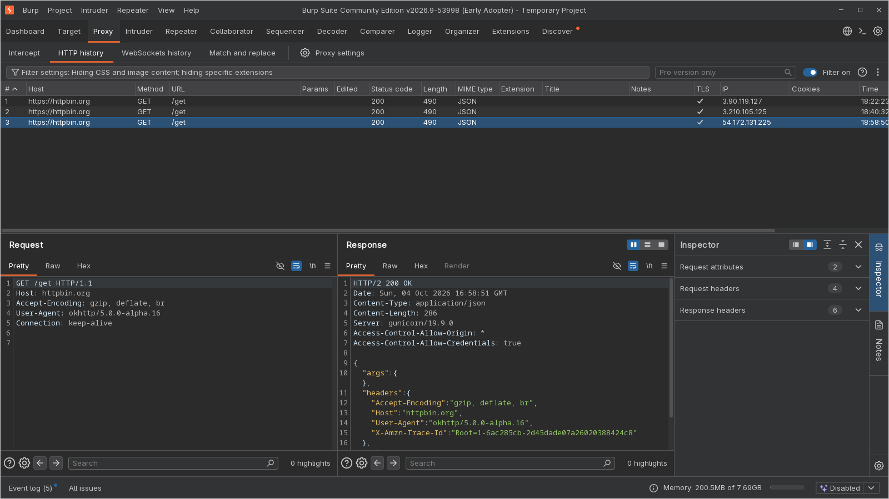

# Burp

## Use case

Inspect and intercept HTTPS traffic.

## Explanation

Point the app at Burp's proxy. This only reveals plain HTTP. HTTPS fails validation until Burp's CA is trusted.

Since Android 14 the trust store lives in the immutable `com.android.conscrypt` APEX at `/apex/com.android.conscrypt/cacerts`. Each process has its own mount namespace, so the cert must be bind-mounted into `zygote` (so forked apps inherit it).

## Usage

Burp:

- Proxy --> Proxy settings --> Import/export CA certificate --> Certificate in DER format
- Proxy --> Proxy settings --> Proxy listeners --> Bind to all interfaces (0.0.0.0)

```
$ openssl x509 -inform DER -in cacert.der -out cacert.pem
$ openssl x509 -inform PEM -subject_hash_old -in cacert.pem | head -1
9a5ba575
$ mv cacert.pem 9a5ba575.0
$ cat 9a5ba575.0 | openssl x509 -noout -subject -issuer
subject=C=PortSwigger, ST=PortSwigger, L=PortSwigger, O=PortSwigger, OU=PortSwigger CA, CN=PortSwigger CA
issuer=C=PortSwigger, ST=PortSwigger, L=PortSwigger, O=PortSwigger, OU=PortSwigger CA, CN=PortSwigger CA
$ adb push 9a5ba575.0 /data/local/tmp/

$ mkdir -p -m 700 /data/local/tmp/ca-copy
$ cp /apex/com.android.conscrypt/cacerts/* /data/local/tmp/ca-copy/
$ cp /data/local/tmp/9a5ba575.0 /data/local/tmp/ca-copy/

# overlay the legacy dir
$ mount -t tmpfs tmpfs /system/etc/security/cacerts
$ cp /data/local/tmp/ca-copy/* /system/etc/security/cacerts/
$ chown root:root /system/etc/security/cacerts/*
$ chmod 644 /system/etc/security/cacerts/*
$ chcon u:object_r:system_security_cacerts_file:s0 /system/etc/security/cacerts/*

# bind it over APEX
$ mount --bind /system/etc/security/cacerts /apex/com.android.conscrypt/cacerts

$ adb shell pgrep -f zygote
477
1022
$ nsenter --mount=/proc/477/ns/mnt -- /bin/mount --bind /system/etc/security/cacerts /apex/com.android.conscrypt/cacerts
$ nsenter --mount=/proc/1022/ns/mnt -- /bin/mount --bind /system/etc/security/cacerts /apex/com.android.conscrypt/cacerts    

$ adb shell settings get global http_proxy           
null
$ adb shell settings put global http_proxy 10.0.2.2:8080
$ adb shell settings get global http_proxy
10.0.2.2:8080

# reset later
$ adb shell settings put global http_proxy :0

$ adb shell am force-stop com.example.test
$ adb shell am start -n com.example.test/.MainActivity
Starting: Intent { cmp=com.example.test/.MainActivity }

# get the full name of the mangled check symbol
$ dexdump -d ./test/test-app/app/build/intermediates/dex/debug/mergeExtDexDebug/classes2.dex | grep check\$okhttp -A 1
026b3e: 6e30 d803 2100                         |000f: invoke-virtual {v1, v2, v0}, Lokhttp3/CertificatePinner;.check$okhttp_release:(Ljava/lang/String;Lkotlin/jvm/functions/Function0;)V // method@03d8
026b44: 0e00                                   |0012: return-void
--
      name          : 'check$okhttp_release'
      type          : '(Ljava/lang/String;Lkotlin/jvm/functions/Function0;)V'
--
0268bc:                                        |[0268bc] okhttp3.CertificatePinner.check$okhttp_release:(Ljava/lang/String;Lkotlin/jvm/functions/Function0;)V
0268cc: 1a00 cc1e                              |0000: const-string v0, "hostname" // string@1ecc
--
044026: 6e30 d803 7408                         |0119: invoke-virtual {v4, v7, v8}, Lokhttp3/CertificatePinner;.check$okhttp_release:(Ljava/lang/String;Lkotlin/jvm/functions/Function0;)V // method@03d8
04402c: 6e10 4b04 0d00                         |011c: invoke-virtual {v13}, Lokhttp3/ConnectionSpec;.supportsTlsExtensions:()Z // method@044b

$ adb shell ps -ef | grep test           
u0_a220       4914   477 0 18:40:06 ?     00:00:05 com.example.test
u0_a220       4931   477 0 18:40:06 ?     00:00:00 com.example.test:worker1
u0_a220       4932   477 0 18:40:06 ?     00:00:00 com.example.test:worker2
$ frida -U -p 4914 -l cert-pin-bypass.js                                                                                                  
     ____
    / _  |   Frida 17.22.0 - A world-class dynamic instrumentation toolkit
   | (_| |
    > _  |   Commands:
   /_/ |_|       help      -> Displays the help system
   . . . .       object?   -> Display information about 'object'
   . . . .       exit/quit -> Exit
   . . . .
   . . . .   Prefer a GUI? Luma is the official Frida app, with a live REPL,
   . . . .   persistent sessions & collaboration. https://luma.frida.re/
   . . . .
   . . . .   Connected to Android Emulator 5554 (id=emulator-5554)
                                                                                
[Android Emulator 5554::PID::4914 ]-> Bypassed
```

```js
{{#include ../../src/frida/cert-pin-bypass.js}}
```



References:

- <https://httptoolkit.com/blog/android-14-install-system-ca-certificate/>
- <https://source.android.com/docs/core/ota/modular-system/conscrypt>
- <https://www.redfoxsec.com/blog/installing-burp-suites-ca-as-a-system-certificate-on-android>
- <https://codeshare.frida.re/@silva95gustavo/okhttp3-certificate-pinner-bypass/>
