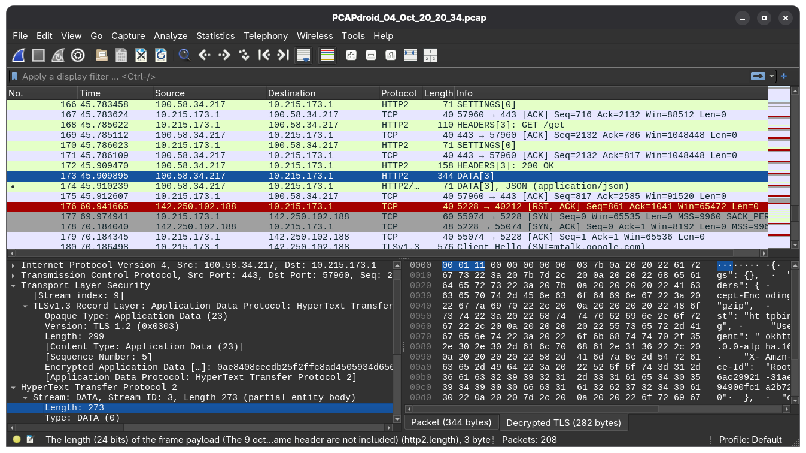

# PCAPdroid

## Use case

Capture network traffic per-app (not only HTTP/HTTPS). Optionally decrypt HTTPS.

## Explanation

Capture packets via local VPN, dump them as `.pcap` + log the session keys.

Since Android 14 the trust store lives in the immutable `com.android.conscrypt` APEX at `/apex/com.android.conscrypt/cacerts`. Each process has its own mount namespace, so the cert must be bind-mounted into `zygote` (so forked apps inherit it).

## Usage

```
$ wget https://github.com/emanuele-f/PCAPdroid/releases/download/v2.0.2/PCAPdroid_v2.0.2.apk
$ wget https://github.com/emanuele-f/PCAPdroid-mitm/releases/download/v2.4/PCAPdroid-mitm_v2.4_x86_64.apk
$ adb install PCAPdroid_v2.0.2.apk
$ adb install PCAPdroid-mitm_v2.4_x86_64.apk

```

PCAPdroid: Settings --> Enable TLS decryption (+ complete the setup guide)

```
$ cat /data/misc/user/0/cacerts-added/81c450f1.0 | openssl x509 -noout -subject -issuer 
subject=CN=PCAPdroid CA, O=PCAPdroid
issuer=CN=PCAPdroid CA, O=PCAPdroid
$ mkdir -p -m 700 /data/local/tmp/ca-copy
$ cp /apex/com.android.conscrypt/cacerts/* /data/local/tmp/ca-copy/
$ cp /data/misc/user/0/cacerts-added/81c450f1.0 /data/local/tmp/ca-copy/

# overlay the legacy dir
$ mount -t tmpfs tmpfs /system/etc/security/cacerts
$ cp /data/local/tmp/ca-copy/* /system/etc/security/cacerts/
$ chown root:root /system/etc/security/cacerts/*
$ chmod 644 /system/etc/security/cacerts/*
$ chcon u:object_r:system_security_cacerts_file:s0 /system/etc/security/cacerts/*

# bind it over APEX
$ mount --bind /system/etc/security/cacerts /apex/com.android.conscrypt/cacerts

$ adb shell pgrep -f zygote
477
1022
$ nsenter --mount=/proc/477/ns/mnt -- /bin/mount --bind /system/etc/security/cacerts /apex/com.android.conscrypt/cacerts
$ nsenter --mount=/proc/1022/ns/mnt -- /bin/mount --bind /system/etc/security/cacerts /apex/com.android.conscrypt/cacerts
```
PCAPdroid:

Decryption rules --> App --> com.example.test

Traffic dump --> PCAP file

Start capturing

```
$ adb shell am force-stop com.example.test
$ adb shell am start -n com.example.test/.MainActivity
```
```
$ adb shell ps -ef | grep test                                                                 
u0_a220       6372   477 7 20:20:13 ?     00:00:03 com.example.test
u0_a220       6391   477 1 20:20:13 ?     00:00:00 com.example.test:worker1
u0_a220       6392   477 1 20:20:13 ?     00:00:00 com.example.test:worker2
$ frida -U -p 6372 -l src/frida/cert-pin-bypass.js
     ____
    / _  |   Frida 17.22.0 - A world-class dynamic instrumentation toolkit
   | (_| |
    > _  |   Commands:
   /_/ |_|       help      -> Displays the help system
   . . . .       object?   -> Display information about 'object'
   . . . .       exit/quit -> Exit
   . . . .
   . . . .   Prefer a GUI? Luma is the official Frida app, with a live REPL,
   . . . .   persistent sessions & collaboration. https://luma.frida.re/
   . . . .
   . . . .   Connected to Android Emulator 5554 (id=emulator-5554)
                                                                                
[Android Emulator 5554::PID::6372 ]-> Bypassed
```
```js
{{#include ../../src/frida/cert-pin-bypass.js}}
```

```
$ adb pull /sdcard/Download/PCAPdroid
$ ls PCAPdroid
PCAPdroid_04_Oct_20_20_34.keylog  PCAPdroid_04_Oct_20_20_34.pcap
```

Wireshark:

Open --> Open Capture File

Edit --> Preferences... --> Protocols --> TLS --> (Pre)-Master-Secret log filename



References:

- <https://github.com/emanuele-f/pcapdroid/releases>
- <https://github.com/emanuele-f/PCAPdroid-mitm/releases>

